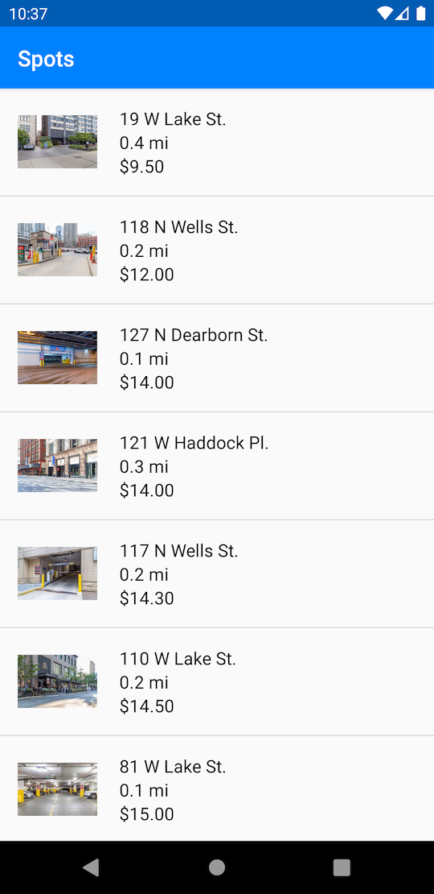

# SH-1

## User Story

As a Customer, I would like to see a list of Spots when the app launches.

## Acceptance Criteria

* The Action Bar background color is #0082FF.
* The Action Bar text color is #FFFFFF.
* The Status bar background color is #005CB3.
* The first screen a user sees when launching the app is the `Spots` screen.
* All `Spot` objects returned from the `SpotHeroApi` are shown on the Spots screen in a list.
  * This data and all relevant images are mocked locally in the project during development.
* The `Spot` objects are sorted by price from lowest to highest.
* For each `Spot` row in the list...
  * There photo of the `Spot` is displayed at the left of the row.
    * The photo has a height of 72dp.
    * The photo is aligned to the left and centered vertically.
    * The photo's aspect ratio is maintained.
  * The address of the `Spot` is displayed at the top of the row.
    * The address font size is 16sp.
    * The address is 16dp from the right of the photo.
    * The address extends to the right margin of the row.
  * The distance of the `Spot` is displayed at the middle of the row.
    * The distance font size is 16sp.
    * The distance is 16sp from the right of the photo.
    * The distance is 0dp from the title.
    * The distance is 0dp from the price.
    * The distance extends to the right margin of the row.
  * The price of the `Spot` is displayed at the bottom of the row.
    * The price font size is 16pt.
    * The price is 20pt from the right of the photo.
    * The price is 0pt from the distance.
    * The price extends to the right margin of the row.
  * Address, distance, and price are centered vertically with the photo.
  * The screen is scrollable.
  * Selecting a row has the default Android system highlight.
    * The highlight goes away after the row is selected.

## Screenshots

