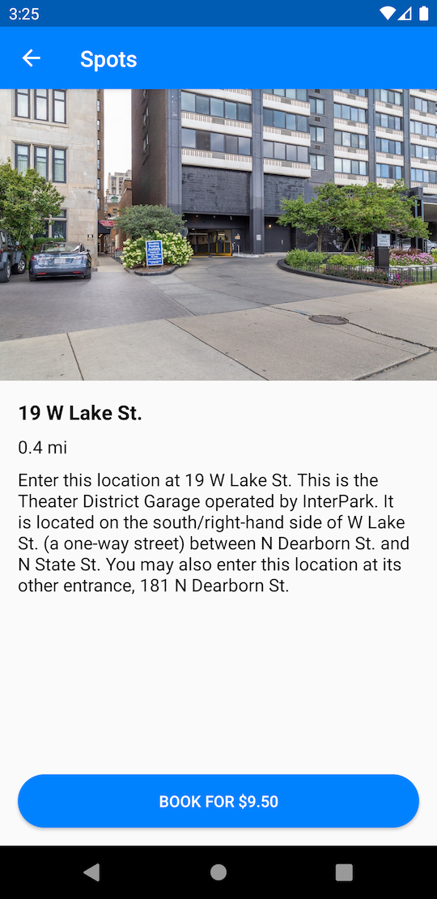

# SH-2

## User Story

As a Customer, I would like to view Spot Details when I click on a Spot.

## Acceptance Criteria

* The Action Bar background color is #0082FF.
* The Action Bar text color is #FFFFFF.
* The Status bar background color is #005CB3.
* Selecting a `Spot` from the `Spots` screen opens the Spot Details screen for that `Spot`.
* The title of the `Spot Details` screen is the street address of the `Spot`.
* The photo of the `Spot` is displayed at the top of the screen.
  * The photo is aligned to the bottom of the navigation bar.
  * The photo is fixed to the left and right sides of the screen.
  * Aspect ratio is maintained.
* The title of the `Spot` is below the photo.
  * The title font weight is bold.
  * The title font size is 18sp.
  * The title is 16dp from the bottom of the photo.
  * The title is 16dp from the left side of the screen.
* The distance of the `Spot` is below the title.
  * The distance font size is 16sp.
  * The distance is 8dp from the bottom of the title.
  * The distance is 16dp from the left side of the screen.
* The description of the `Spot` is below the distance.
  * The description font size is 16sp.
  * The description is 8dp from the bottom of the distance.
  * The description is 16dp from the left side of the screen.
* Add a "Book Now" button to the bottom of the Spot Details screen.
  * The button has rounded corners with a 32dp radius.
  * The button background color is #0082FF.
  * The button is fixed to the bottom of the screen.
  * The button is 16dp from the left and right side of the screen.
  * The button includes the text "Book for $X", where X is the price of the `Spot` including cents.

## Screenshots

