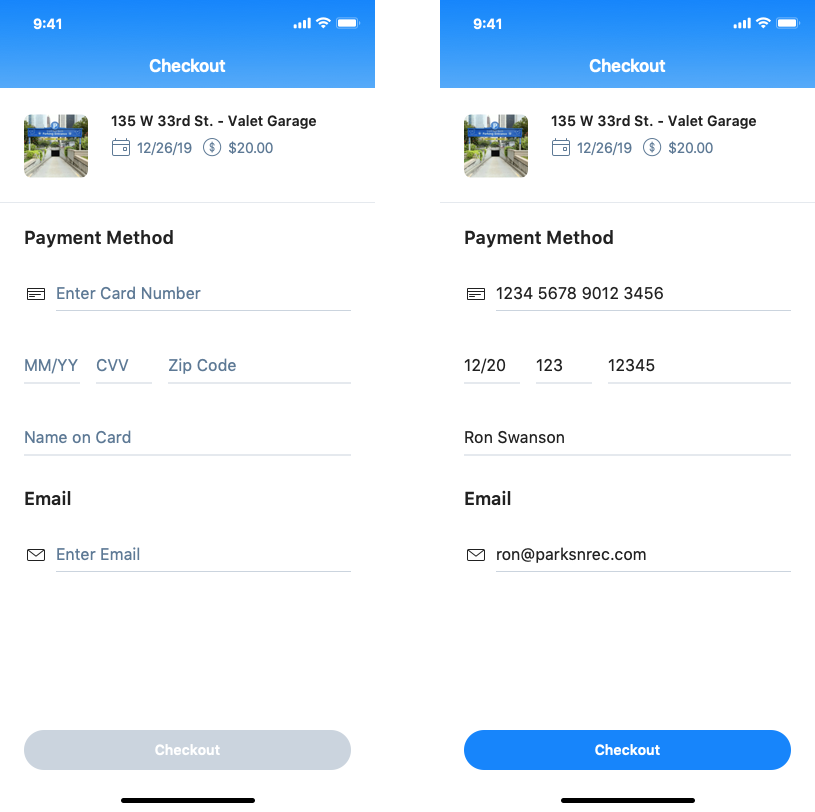

# SH-4

## User Story

As a Customer, I would like to enter checkout from the Spot Details screen.

## Acceptance Criteria

* The checkout header exists. 
  * The header says, "Checkout."
* The summary section exists.
  * There is a spot image 
  * Location Address 
  * Date of the Reservation 
  * Includes calendar icon.
  * Price of the Reservation. 
  * Includes price icon.
* The payment method section exists. 
  * The section title says, "Payment Method." 
  * There is a credit card input field with a payment icon. The hint text says, "Enter Credit Card Number."
  * There is an expiration date input field. The hint text says, "MM/YY."
  * There is a CVV input field. The hint text says, "CVV."
  * There is a Zip Code input field. The hint text says, "Zip Code."
  * There is a card name input field. The hint text says, "Name on Card."
* The email section exists.
  * There is an email input field with an email icon. The hint text says, "Enter Email."
* The checkout button exists. 
  * The button is disabled until the user enters all of the required fields. 
  * Tapping the enabled checkout button takes the user to a reservation screen. 

## Screenshots

